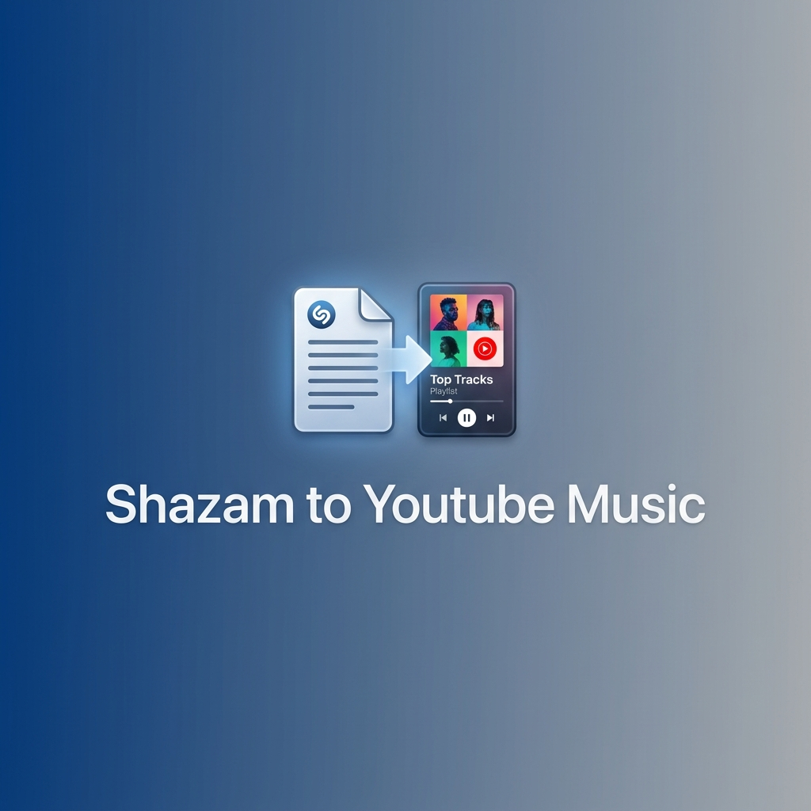

# Shazam to YouTube Music Playlist Converter



Convert your Shazam export CSV into a YouTube Music playlist.

## Features

- Reads Shazam export CSV files
- Searches for each song on YouTube Music
- Creates a new playlist with all found songs
- Handles various CSV column formats (Title/Song/Track, Artist, Album)

## Prerequisites

- Python 3.7 or higher
- YouTube Music account

## Installation

1. Install dependencies:
```bash
pip install -r requirements.txt
```

2. Authenticate with YouTube Music:
```bash
ytmusicapi oauth
```

Follow the instructions to authenticate. This will create an `oauth.json` file in the current directory.

> **Note**: If you receive a `KeyError: 'verification_url'` error when authenticating, this is due to a recent Google API change. As a workaround, use the Browser Authentication method:
> 
> 1. Open [music.youtube.com](https://music.youtube.com) in your browser and log in.
> 2. Open Developer Tools (F12) -> Network tab.
> 3. Perform an action on the site (like clicking "Library") and find any request to `music.youtube.com` (e.g. `browse`).
> 4. Right-click the request -> Copy -> Copy request headers.
> 5. Run `ytmusicapi browser` in your terminal and paste the headers. Press `Ctrl-Z` and `Enter` to save.
> 6. This creates a `browser.json` file. You can pass it to the script using `--oauth-file browser.json`.

## Usage

```bash
python shazam_to_youtube_music.py <shazam_csv_file> <playlist_name> [--description "description"] [--oauth-file oauth.json]
```

### Arguments

- `csv_file`: Path to your Shazam export CSV file
- `playlist_name`: Name for the new YouTube Music playlist
- `--description`: (Optional) Description for the playlist (default: "Created from Shazam export")
- `--oauth-file`: (Optional) Path to OAuth token file (default: oauth.json)

### Example

```bash
python shazam_to_youtube_music.py my_shazam_songs.csv "My Shazam Discoveries" --description "Songs I discovered with Shazam"
```

## Shazam CSV Format

The script expects a CSV with at least the following columns (case-insensitive):
- **Title** (or "Song" or "Track")
- **Artist**

Optional columns:
- **Album**

Example CSV:
```csv
Title,Artist,Album,Date
"Blinding Lights","The Weeknd","After Hours","2024-01-15"
"Levitating","Dua Lipa","Future Nostalgia","2024-01-16"
```

## How It Works

1. Reads the Shazam CSV export
2. Extracts song titles and artists
3. Searches for each song on YouTube Music
4. Attempts to find exact matches by artist
5. Creates a new playlist with all found songs
6. Outputs the playlist ID and URL

## Notes

- The script skips songs that cannot be found on YouTube Music
- If multiple results are found, it prioritizes exact artist matches
- You need a YouTube Music Premium account to create playlists
